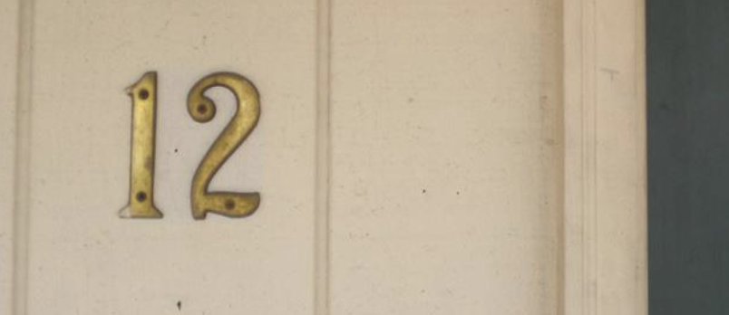
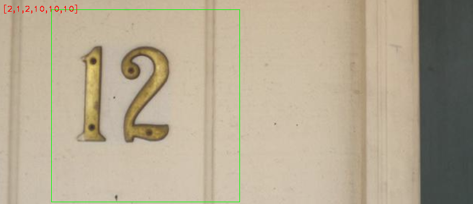
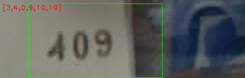
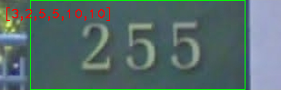

# House-Number-Recognition

Referencing paper: https://static.googleusercontent.com/media/research.google.com/en//pubs/archive/42241.pdf

To train the classification model and the house number detection model, run the following steps:
1. `python prepare_data.py` to download, extract, get metadata, save data to local for training. Using [SVHN data source](http://ufldl.stanford.edu/housenumbers/)

2. `python classification_train_test_split.py` to split train and test dataset for classification model training

3. `python train_classification_model.py` This script is to be run on GPU to train customized, vgg16_scratch, vgg16_pretrained models. The model results and the training history will be dumped to models/customized, models/vgg16_scratch, models/vgg16_pretrained in local. These models are saved [here](https://drive.google.com/open?id=1F-8XwEzAn5GaJyWi6oPzdVzv0hIWXb9t) due to file size limit on github. These models can be used directly for prediction.

4. `python get_classification_performance_plot.py` to plot model training history: accuracy and loss as epochs increase for customized, vgg16_scratch and vgg16_pretrained models. The results are in `plot/`.

5. `python get_sequence_accuracy.py` to get sequence accuracy on train, valid, test dataset and print to console

6. `python train_detection_model.py` to train the detection model on gpu and save the model result in models/detection in local. The trained model is stored [here](https://drive.google.com/open?id=1xxBEGTMg1P3Co-pJ3ZwqbzCkSHkx0vIw).

7. `python run.py` will give classification and detection results from `input/` and output to `output/`

Sample input:
 
 
 

Sample output: Output result in the format of array of length 6. 
E.g For the first output image, the first digit represents the number of digits in the house number. The rest are the actual house number. If the number digits in the house number is fewer than 5, use 10 to fill the remaining of the array.

 
 

